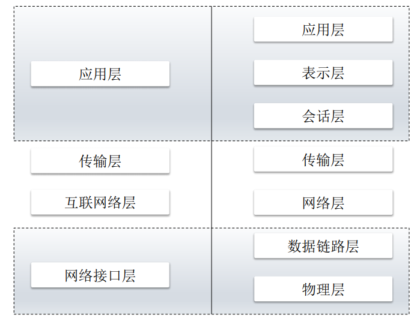

# <center>爬虫</center>

#### HTTP协议

* TPC/IP四层协议与OSI七层协议
    * 物理层 ： 电器连接
    * 数据链路层： 交换机
    * 网络层：路由器、IP协议
    * **传输层**：TCP、UDP协议
    * 会话层：建立通信连接，网络拨号
    * 表示层：每次连接只处理一个请求
    * **应用层**：HTTP、FTP
  
* 特点
    * 无连接：每次连接只处理一个请求
    * 无状态：每次连接、传输都是独立的

* Request Header

```python

```

* Status Code
    * 2XX 成功
    * 3XX 跳转 （一般不用单独处理，比如urllib2会自动处理）
        * 300 存在多个可用资源，可丢弃或处理
        * 301 Move Permanetly 重定向
        * 302 Found 重定向
        * 304 Not Modified 请求的资源未更新，丢弃
    * 4XX 客户端错误
        * 400 Bad request 客户端请求有语法错误
        * 401 Unauthorized 未授权 （如果需要登录的网站，尝试重新登录）
        * 403 Forbidden 服务器收到请求，拒绝提供服务（IP被封，暂停爬取，增加等待时间）
        * 404 请求资源不存在
    * 5XX 服务器错误（直接丢弃并计数，连续不成功，WARNING并停止爬取）
        * 500 服务器发生不可预期的错误
        * 503 服务器当前不能处理该请求，一段时间后可能恢复
    
#### 爬取对象类型

* 静态网页
* 动态网页
  * 京东、淘宝
* WebService（需要找到API入口）
  * 微博

#### 爬取策略
* BFS(方便并行) + max_depth
* 不重复策略
    * URL经过md5/sha1等单向哈希后保存到HashSet或数据库
    * bitmap，URL经过哈希函数后映射到某一位或多位
    * bloom过滤器，使用多个Hash函数减少碰撞概率
    * python库：mmh3、bitarray、pybloomfilter
    * 分布式： redis（持久化）
#### 前端知识
* HTML定位方式(DOM Tree)
    * Tag
    * id
    * class
* CSS

* JS
    * AJAX

#### 解析库

* re

* xpath

* lxml / beautifulsoup4 / scrapy / selenium 动态选择器