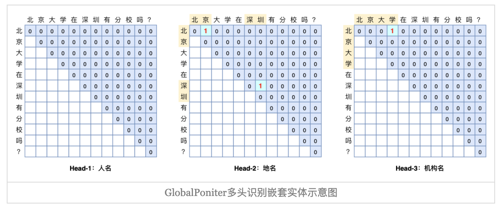

<h1>GlobalPointer</h1>

> 1. GlobalPointer用统一的方式处理嵌套和非嵌套NER，可以达到和CRF一样甚至更好的效果。
> 2. 在训练过程中，不需要像CRF那样递归计算分母，因此训练比CRF快很多。
> 3. 在预测过程中，不需要像CRF那样使用动态规划进行解码，因此速度也会比CRF快。
> 4. 总结来说，GlobalPointer设计更优雅，更快速，更强大。

## 一、基本思路
一般的pointer网络，会将首和尾分开，各用一个模块去识别，后续还需要使用二分类模型去补救，而GlobalPointer的Global体现在：它将实体的首尾位置视为一个整体去识别。

> 核心思想：将序列标注问题转化为m个"$$\frac{n(n+1)}{2}$$选k"的多标签分类问题，以实体为基本单位进行识别。(CRF的复杂度为$$m^n$$)

## 二、数学形式
输入：
$$[\pmb{h}_1, \pmb{h}_2, ...... ,\pmb{h}_n]$$

变换：
$$
\begin{align}
\pmb{q}_{i,\alpha}=\pmb{W}_{q,\alpha}\pmb{h}_i+\pmb{b}_{q,\alpha} \Rightarrow [\pmb{q}_{1,\alpha}, \pmb{q}_{2,\alpha}, ...... , \pmb{q}_{n,\alpha}] \\
\pmb{k}_{i,\alpha}=\pmb{W}_{k,\alpha}\pmb{h}_i+\pmb{b}_{k,\alpha} \Rightarrow [\pmb{k}_{1,\alpha}, \pmb{k}_{2,\alpha}, ...... , \pmb{k}_{n,\alpha}]
\end{align}
$$

那么，从$$i$$到$$j$$的连续片段是一个类型为$$\alpha$$的实体的打分函数为：
$$
s_\alpha(i, j)=\pmb{q}_{i,\alpha}^T\pmb{k}_{j,\alpha}
$$
即Multi-Head Attention的简化版。

## 三、融入相对位置信息
如果没有相对位置信息输入的话，GlobalPointer对实体的长度和跨度都不是特别敏感，因此很容易把任意两个实体的首尾组合当成目标预测出来。

> 举例：北京：21度；上海：22度；杭州：23度；广州：24度；

> 预测结果：北京：21度；上海（地点实体）

融入旋转式相对位置编码(RoPE):
$$
\begin{aligned}
s_\alpha(i,j)&=(\pmb{R}_i\pmb{q}_{i,\alpha})^T(\pmb{R}_j\pmb{k}_{j,\alpha}) \\
&=\pmb{q}_{i,\alpha}^T\pmb{R}_i^T\pmb{R}_j\pmb{k}_{j,\alpha} \\
&=\pmb{q}_{i,\alpha}^T\pmb{R}_{i-j}\pmb{k}_{j,\alpha}
\end{aligned}
$$

RoPE编码方式来自于一篇论文：[《RoFormer: Enhanced Transformer with Rotary Position Embedding》](https://arxiv.org/abs/2104.09864)，其亮点在于用绝对位置编码方式实现相对位置编码，稍后会细讲。

## 四、损失函数
对于打分函数$$s_\alpha(i,j)$$设计损失函数，最简单的想法是将多标签分类转换为$$\frac{n(n+1)}{2}$$个二分类问题，将多个二分类的交叉熵损失相加。但一般n不小，$$\frac{n(n+1)}{2}$$就更大，但实体数量不会很多，如果是$$\frac{n(n+1)}{2}$$个二分类的话，会带来严重的类别不均衡问题。可以考虑将“softmax交叉熵”推广到多标签分类问题：
$$
log(1+\sum_{(i,j)\in P_\alpha}e^{-s_\alpha(i,j)}) + log(1+\sum_{(i,j)\in Q_\alpha}e^{s_\alpha(i,j)})
$$
其中，
$$
\begin{aligned}
\Omega&=\{(i, j) | 1 \leq i \leq j \leq n\} \\
P_\alpha &= \{(i, j) | t[i:j]是类型为\alpha的实体\} \\
Q_\alpha &= \Omega - P_\alpha
\end{aligned}
$$

在解码阶段，所有满足$$s_\alpha(i,j)>0$$的片段$$t[i:j]$$都被视为$$\alpha$$的实体输出，解码过程非常简单。稍后会细讲该损失函数。