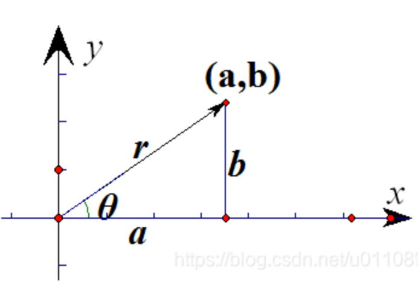

<center><h1>RoPE</h1></center>

> 1. 绝对位置编码优点：实现简单，计算速度快。
> 2. 相对位置编码优点：直接体现了相对位置信号，实际性能更好。
> 3. 如果能够使用绝对位置编码的方式实现相对位置编码，那便“鱼和熊掌兼得”。
> 4. RoPE $\Rightarrow$ Rotrary Position Embedding

## 一、问题抽象
如果想要用绝对位置编码的方式实现相对位置编码。

（1）那么我们先要考虑，假设能够设计出操作$\pmb{f}(\cdot, m)$，$\pmb{f}(\cdot, n)$，使得经过该操作后，$\widetilde{\pmb{q}}_m$，$\widetilde{\pmb{k}}_n$就带有了$m$，$n$的绝对位置信息，即：
$$
\begin{aligned}
\widetilde{\pmb{q}}_m &= \pmb{f}(\pmb{q}, m) \\
\widetilde{\pmb{k}}_n &= \pmb{f}(\pmb{k}, n)
\end{aligned}
$$

（2）下一步需要考虑，Attention的核心运算是内积，所以我们希望内积运算结果可以自动带有相对位置信息，因此假设存在恒等关系：
$$
<\pmb{f}(\pmb{q}, m), \pmb{f}(\pmb{k}, n)> = g(\pmb{q}, \pmb{k}, m-n)
$$

如果我们能够根据恒等式，求出$\pmb{f}(\cdot, m)$一个尽可能简单的解，那么我们就能够得到满足以上两个条件的变换操作，即用绝对位置编码的方式实现了相对位置编码。

设初始条件：$\pmb{f}(\pmb{q},0) = \pmb{q}$，$\pmb{f}(\pmb{k},0) = \pmb{k}$

## 二、求解
借助复数来求解。

因为在复数中有$<\pmb{q}, \pmb{k}> = Re[\pmb{q}\pmb{k}^*]$，再根据恒等式我们可以得到:
$$Re[\pmb{f}(\pmb{q}, m)\pmb{f}^*(\pmb{k}, n)] = g(\pmb{q},\pmb{k},m-n) \tag{1.1}$$

若想让(1)式成立的话，我们假设存在复数$\pmb{g}(\pmb{q}, \pmb{k}, m-n)$，使得
$$\pmb{f}(\pmb{q}, m)\pmb{f}^*(\pmb{k}, n)=\pmb{g}(\pmb{q}, \pmb{k}, m-n) \tag{1.2}$$

使用复数的指数形式：
$$
\begin{aligned}
\pmb{f}(\pmb{q}, m) &= R_{\pmb{f}}(\pmb{q},m)e^{i\theta_{\pmb{f}}(\pmb{q},m)} \\
\pmb{f}(\pmb{k}, n) &= R_{\pmb{f}}(\pmb{k},n)e^{i\theta_{\pmb{f}}(\pmb{k},n)} \\
\pmb{g}(\pmb{q}, \pmb{k}, m-n) &= R_{\pmb{g}}(\pmb{q},\pmb{k},m-n)e^{i\theta_{\pmb{g}}(\pmb{q},\pmb{k},m-n)} \tag{2}
\end{aligned}
$$

如果我们能够求出(2)式中的$R$和$\theta$，那么我们就可以表示变换$f$。

将(2)式代入(1.2)式得：
$$\begin{aligned}
R_{\pmb{f}}(\pmb{q},m)\cdot R_{\pmb{f}}(\pmb{k},n) &= R_{\pmb{g}}(\pmb{q},\pmb{k},m-n) \\
\theta_{\pmb{f}}(\pmb{q},m)-\theta_{\pmb{f}}(\pmb{k},n) &= \theta_{\pmb{g}}(\pmb{q},\pmb{k},m-n) \tag{3}
\end{aligned}$$

对(3)式中的第一个等式代入$m=n=0$:
$$
\begin{aligned}
R_{\pmb{f}(\pmb{q},m)}\cdot R_{\pmb{f}(\pmb{k},m)} &= R_{\pmb{g}(\pmb{q},\pmb{k},0)} \\
&= R_{\pmb{f}(\pmb{q},0)}\cdot R_{\pmb{f}(\pmb{k},0)} \\
& = ||\pmb{q}||\cdot||\pmb{k}|| \tag{4}
\end{aligned}
$$

$\Rightarrow$

$$
\begin{aligned}
R_{\pmb{f}}(\pmb{q},m) &= ||\pmb{q}|| \\
R_{\pmb{f}}(\pmb{k},m) &= ||\pmb{k}|| 
\end{aligned} \tag{7}
$$
即不依赖于$m$。

对(3)式中的第二个等式代入$m=n=0$:
$$
\begin{aligned}
\theta_{\pmb{f}}(\pmb{q},m)-\theta_{\pmb{f}}(\pmb{k},m) &= \theta_{\pmb{g}}(\pmb{q},\pmb{k},0) \\
&= \theta_{\pmb{f}}(\pmb{q},0)-\theta_{\pmb{f}}(\pmb{k},0) \\
&= \theta(\pmb{q})-\theta(\pmb{k})
\end{aligned} \tag{5}
$$

$\Rightarrow$

$$
\theta_{\pmb{f}}(\pmb{q},m)-\theta(\pmb{q})=\theta_{\pmb{f}}(\pmb{k},m)-\theta(\pmb{k})
$$

可以看出$\theta_{\pmb{f}}(\pmb{q},m)-\theta(\pmb{q})$只与$m$相关，记为$\psi(m)$，则有:
$$\theta_{\pmb{f}}(\pmb{q},m)=\theta(\pmb{q})+\psi(m) \tag{6}$$

令$n=m-1$:
$$\begin{aligned}
\psi(m) &= \theta_{\pmb{f}}(\pmb{q},m) - \theta(\pmb{q}) \\
\psi(m-1) &= \theta_{\pmb{f}}(\pmb{q},m-1) - \theta(\pmb{q})
\end{aligned}$$
$\Rightarrow$
$$\begin{aligned}
\psi(m) - \psi(n) &= \psi(m) - \psi(m-1) \\
&= \theta_{\pmb{f}}(\pmb{q},m) - \theta_{\pmb{f}}(\pmb{q},m-1)
\end{aligned}$$
将(3)式中的第二行代入：
$$\begin{aligned}
\psi(m) - \psi(m-1) &= \theta_{\pmb{g}}(\pmb{q},\pmb{k},m-n)+\theta_{\pmb{f}}(\pmb{k},n)-\theta_{\pmb{f}}(\pmb{q},m-1) \\
&= \theta_{\pmb{g}}(\pmb{q},\pmb{k},1) + \theta_{\pmb{f}}(\pmb{k},m-1) - \theta_{\pmb{f}}(\pmb{q},m-1)
\end{aligned}$$
将(5)式代入：
$$\begin{aligned}
\psi(m) - \psi(m-1) &= \theta_{\pmb{g}}(\pmb{q},\pmb{k},1) + \theta(\pmb{k}) - \theta(\pmb{q})
\end{aligned}$$
可以看出$\psi(m) - \psi(m-1)$与$m$无关，因此$\psi(m)$是等差数列。设$\psi(m) - \psi(m-1) = \theta$，$\theta$为常数。根据等差数列通项公式，有：
$$\begin{aligned}
\psi(m) &= \psi(m = 0) + m\theta \\
&= 0 + m\theta \\
\Rightarrow \psi(m) &= m\theta
\end{aligned} \tag{8}$$

由此我们推得了变换$\pmb{f}(\pmb{q}, m)$:
$$\begin{aligned}
\pmb{f}(\pmb{q}, m) &= R_{\pmb{f}}(\pmb{q},m)e^{i\theta_{\pmb{f}}(\pmb{q},m)} \\
根据(6),(7),(8)\Rightarrow &= ||\pmb{q}||e^{i(\theta(\pmb{q})+m\theta)} \\
&= ||q||e^{i\theta(\pmb{q})}\cdot e^{im\theta} \\
&= \pmb{q}\cdot e^{im\theta}
\end{aligned} \tag{9}$$
得到变换的结果后，是无法直接写成代码实现的。但我们可以发现该变换是两个复数相乘，两个复数相乘的几何意义为旋转。

## 三、转换成代码形式
根据(9)式以及复数相乘的几何意义，我们可以理解成(9)式就是对复数$\pmb{q}$对应的向量旋转$m\theta$角度：
$$\begin{aligned}
\pmb{f}(\pmb{q}, m) &= \pmb{q}\cdot e^{im\theta} \\
&= \left[
  \begin{matrix}
   cosm\theta & -sinm\theta \\
   sinm\theta & cosm\theta
  \end{matrix}
  \right] 
  \left[
  \begin{matrix}
   q_0 \\
   q_1
  \end{matrix}
  \right] 
\end{aligned} \tag{10}$$
由于内积满足线性叠加性，因此任意偶数维的RoPE可以表示为二维情形的拼接：
$$
\left[
  \begin{matrix}
   cosm\theta_0 & -sinm\theta_0 & 0 & 0 & ... & 0 & 0\\
   sinm\theta_0 & cosm\theta_0 & 0 & 0 & ... & 0 & 0\\
   0 & 0 & cosm\theta_1 & -sinm\theta_1 &  ... & 0 & 0\\
   0 & 0 & sinm\theta_1 & cosm\theta_1 &  ... & 0 & 0\\
   ... & ... & ... & ... &  ... & ... & ...\\
   0 & 0  &  ... & 0 & 0 & cosm\theta_{d/2-1} & -sinm\theta_{d/2-1}\\
   0 & 0  &  ... & 0 & 0 & sinm\theta_{d/2-1} & cosm\theta_{d/2-1}\\
  \end{matrix}
  \right] 
  \left[
  \begin{matrix}
   q_0 \\
   q_1 \\
   q_2 \\
   q_3 \\
   ... \\
   q_{d-2} \\
   q_{d-1}
  \end{matrix}
  \right] 
\tag{11}$$
(11)式的左边就是$R_m$。

给位置为$m$的向量$\pmb{q}$乘上矩阵$R_m$，位置为$n$的向量$\pmb{k}$乘上矩阵$R_n$，用变换后的$\pmb{Q}$，$\pmb{K}$序列作Attention，那么Attention自动包含相对位置信息，因为成立恒等式：
$$\begin{aligned}
(R_m\pmb{q})^T(R_n\pmb{k}) &= \pmb{q}^TR_m^TR_n\pmb{k} \\
&= \pmb{q}^TR_{n-m}\pmb{k}
\end{aligned} \tag{12}$$
其中(12)式从第一行到第二行，利用三角恒等式即可推导出来，很简单。

其实，(11)式的矩阵相乘已经可以用代码实现了，但是$R_m$是个稀疏矩阵，所以直接用矩阵乘法来实现会很浪费算力，因此将其改为如下形式：
$$
\begin{aligned}
 \left[
  \begin{matrix}
   q_0 \\
   q_1 \\
   q_2 \\
   q_3 \\
   ... \\
   q_{d-2} \\
   q_{d-1}
  \end{matrix}
  \right] \bigotimes
  \left[
  \begin{matrix}
   cosm\theta_{0} \\
   cosm\theta_{0} \\
   cosm\theta_{1} \\
   cosm\theta_{1} \\
   ... \\
   cosm\theta_{d/2-1} \\
   cosm\theta_{d/2-1}
  \end{matrix}
  \right] + 
  \left[
  \begin{matrix}
   -q_1 \\
   q_0 \\
   -q_3 \\
   q_2 \\
   ... \\
   -q_{d-1} \\
   q_{d-2}
  \end{matrix}
  \right] \bigotimes
  \left[
  \begin{matrix}
   sinm\theta_{0} \\
   sinm\theta_{0} \\
   sinm\theta_{1} \\
   sinm\theta_{1} \\
   ... \\
   sinm\theta_{d/2-1} \\
   sinm\theta_{d/2-1}
  \end{matrix}
  \right]
\end{aligned} \tag{13}
$$

因此RoPE的核心代码就是(13)式：

```python
class GlobalPointer(layer):

  def call(self, inputs, mask=None):
        # 输入变换
        inputs = self.dense(inputs) # 全链接：q = Wh + b
        # 针对每一个实体类别进行拆分，拆分完的结果是q_alpha, k_alpha序列
        inputs = tf.split(inputs, self.heads, axis=-1)
        inputs = K.stack(inputs, axis=-2)
        qw, kw = inputs[..., :self.head_size], inputs[..., self.head_size:]
        if self.RoPE:
            pos = SinusoidalPositionEmbedding(self.head_size, 'zero')(inputs)
            # 对应公式(13)中的cos部分
            cos_pos = K.repeat_elements(pos[..., None, 1::2], 2, -1)
            # 对应公式(13)中的sin部分
            sin_pos = K.repeat_elements(pos[..., None, ::2], 2, -1)
            # qw2对应公式(13)中的(-q1, q0, -q3, q2, ...)
            qw2 = K.stack([-qw[..., 1::2], qw[..., ::2]], 4) 
            qw2 = K.reshape(qw2, K.shape(qw))
            qw = qw * cos_pos + qw2 * sin_pos
            kw2 = K.stack([-kw[..., 1::2], kw[..., ::2]], 4)
            kw2 = K.reshape(kw2, K.shape(kw))
            kw = kw * cos_pos + kw2 * sin_pos
        # 计算内积
        # qw和kw是包含了绝对位置信息的张量，点积运算使其获得相对位置信息
        logits = tf.einsum('bmhd,bnhd->bhmn', qw, kw)
        # 排除padding
        logits = sequence_masking(logits, mask, '-inf', 2)
        logits = sequence_masking(logits, mask, '-inf', 3)
        # 排除下三角
        if self.tril_mask:
            mask = tf.linalg.band_part(K.ones_like(logits), 0, -1)
            logits = logits - (1 - mask) * K.infinity()
        # scale返回
        # 注意博客中写globalpointer原理的时候并没有scale操作，实现时是有的
        return logits / self.head_size**0.5
```

## 基础知识复习
#### 1. 复数的各种形式
复平面

复平面中的点$(a, b)$对应复数$a+bi$，其共轭为$a-bi$

三角形式：
$$
\begin{aligned}
a &= rcos\theta \\
b &= rsin\theta \\
a + bi &= rcos\theta + risin\theta \\
&= r(cos\theta + isin\theta)
\end{aligned}
$$

指数形式（使用三角形式的乘法进行推导）：$a+bi=re^{i\theta}$ 其共轭为$re^{-i\theta}$

#### 2. 复数相乘的几何意义
以下证明复数相乘的几何意义为旋转。
我们已知复数的三角形式，假设有复数$z_1$和$z_2$，它们的三角形式为：
$$
\begin{aligned}
z_1 &= r_1(cos\theta_1 + isin\theta_1) \\
z_2 &= r_2(cos\theta_2 + isin\theta_2) \\
对应复平面\Rightarrow \pmb{OZ}_1 &= (r_1cos\theta_1, r_1sin\theta_1) \\
\pmb{OZ}_2&= (r_2cos\theta_2, r_2sin\theta_2)
\end{aligned}
$$
从两边向中间证，

左边：
$$
\begin{aligned}
z_1z_2 &= r_1r_2(cos\theta_1 + isin\theta_1)(cos\theta_2 + isin\theta_2) \\
&= r_1r_2(cos\theta_1cos\theta_2+icos\theta_1sin\theta_2+isin\theta_1cos\theta_2-sin\theta_1sin\theta_2) \\
&= r_1r_2[cos(\theta_1+\theta_2)+isin(\theta_1+\theta_2)]
\end{aligned}
$$

右边：
$$
\begin{aligned}
\pmb{OZ}_1 &= (r_1cos\theta_1, r_1sin\theta_1)
\end{aligned}$$
对$\pmb{OZ}_1$旋转$\theta_2$并缩放$r_2$：
$$\begin{aligned}
 r_2\cdot \left[
 \begin{matrix}
   cos\theta_2 & -sin\theta_2 \\
   sin\theta_2 & cos\theta_2
  \end{matrix}
  \right]
  \left[
  \begin{matrix}
   r_1cos\theta_1 \\
   r_1sin\theta_1
  \end{matrix}
  \right] 
&= r_2\cdot \left[
 \begin{matrix}
   r_1cos\theta_1cos\theta_2 - r_1sin\theta_1sin\theta_2 \\
   r_1cos\theta_1sin\theta_2 + r_1cos\theta_2sin\theta_1
  \end{matrix}
  \right] \\
&= r_1r_2\left[
 \begin{matrix}
   cos(\theta_1+\theta_2) \\
   sin(\theta_1+\theta_2)
  \end{matrix}
  \right]
\end{aligned}
$$
由此证明出，$z_1z_2$的几何意义是：把复数$z_1$对应的向量$\pmb{OZ}_1$，绕$O$旋转$\theta_2$，然后再缩放$r_2$对应的复数。

#### 3. 等差数列通项
${a_n}$为等差数列，那么有等差数列通项：
$$a_n = a_1 + (n-1) \times d$$