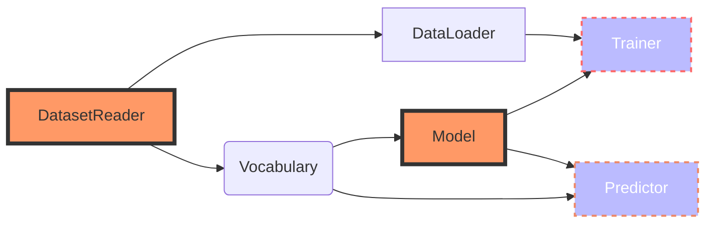
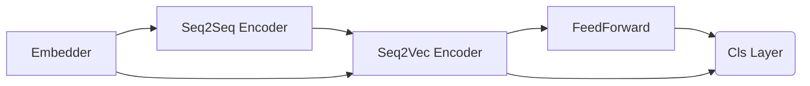
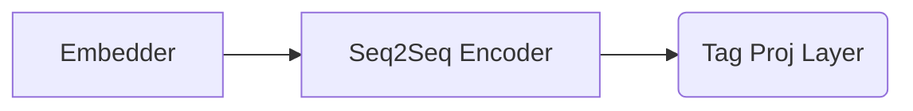

<center><h1>AllenNLP Tutorial</h1></center> 
> allennlp是基于PyTorch扩展的针对NLP任务的High-Level框架，用于提升建模效率及统一建模套路。

#### 总体架构 


一个NLP任务可以抽象成五个模块组成，其中**DatasetReader**模块和**Model**是需要用户参与建设的，allennlp提供了一部分内置组件可供用户使用，也可以根据需求自定义组件。

---

#### DatasetReader


> Embedder原则上属于Model部分,为了方便理解，在该部分一并介绍，Model部分不再介绍Embedder。

* Method
    * 继承DatasetReader实现自己的DatasetReader，尽量实现可重用的代码（比如按任务区分）,也可以为某个数据集定制。
    * 重载`_read()`方法（必选）
    * 重载 `text_to_instance()`方法 (可选)
    * 最终返回 instance 实例
    
* Code Guide

```python
import os
from itertools import islice
from typing import Dict, Iterable

from allennlp.data import DatasetReader, Instance
from allennlp.data.fields import LabelField, TextField
from allennlp.data.token_indexers import TokenIndexer, SingleIdTokenIndexer
from allennlp.data.tokenizers import Token, Tokenizer, WhitespaceTokenizer


# 继承 DatasetReader 并 _read() 和 text_to_instance() 
@DatasetReader.register('classification-tsv')
class ClassificationTsvReader(DatasetReader):
    def __init__(self,
                 tokenizer: Tokenizer = None,
                 token_indexers: Dict[str, TokenIndexer] = None,
                 max_tokens: int = None,
                 **kwargs):
        super().__init__(**kwargs)
        self.tokenizer = tokenizer or WhitespaceTokenizer()
        self.token_indexers = token_indexers or {'tokens': SingleIdTokenIndexer()}
        self.max_tokens = max_tokens

    def text_to_instance(self, text: str, label: str = None) -> Instance:
        tokens = self.tokenizer.tokenize(text)
        if self.max_tokens:
            tokens = tokens[:self.max_tokens]
        text_field = TextField(tokens, self.token_indexers)
        fields = {'text': text_field}
        if label:
            fields['label'] = LabelField(label)
        return Instance(fields)

    def _read(self, file_path: str) -> Iterable[Instance]:
        with open(file_path, 'r') as lines:
            for line in lines:
                text, sentiment = line.strip().split('\t')
                yield self.text_to_instance(text, sentiment)
```

###### Text-to-Tensor Pipeline
> Text --> Token List --> Instance[Field(Indexer)] -->  indexed tensor
 
 * 一般步骤
    1. 选择合适的分词器，将`str str str`切分为`List[str]`， 同时使用`Token`类型维护每一个元素，得到`List[Token]`。
    1. 选择合适的Field维护每一个样本的X部分和Y部分,比如`TextField[List[Token]]`，同时指定索引器字典`Dict[TokenIndexer]`。
    1. `TextFieldEmbedder`（可以看作embedders的盒子）包含不同的`TokenEmbedder`，分别embeds对应的**索引空间**的的索引序列，获得多组Embedding结果(如果指定了一个`TokenEmbedder`结果就一组)，默认情况下将多组Embedding向量在最后一维Concat起来（`TextFieldEmbedder`在发挥作用）。输入的张量shape一般是$$B\times N$$,输出是$$B\times N\times D_{concat}$$，此时一个`Token`对应一个Embedding向量。

 * 一般Token类型
    * 字符 **Characters** ("AllenNLP is great" → ["A", "l", "l", "e", "n", "N", "L", "P", " ", "i", "s", " ", "g", "r", "e", "a", "t"])
    * 片段 **Wordpieces** ("AllenNLP is great" → ["Allen", "##NL", "##P", "is", "great"])
    * 单词 **Words** ("AllenNLP is great" → ["AllenNLP", "is", "great"])

* 通用搭配方法
    * word-level tokenizer
        * SingleIdTokenIndexer → Embedding (for things like GloVe or other simple embeddings, including learned POS tag embeddings)
        * TokenCharactersIndexer → TokenCharactersEncoder (for things like a character CNN)
        * ElmoTokenIndexer → ElmoTokenEmbedder (for ELMo)
        * PretrainedTransformerMismatchedIndexer → PretrainedTransformerMismatchedEmbedder (for using a transformer like BERT when you really want to do modeling at the word level, e.g., for a tagging task)
    * character-level tokenizer
        * SingleIdTokenIndexer → Embedding
    * wordpiece tokenizer
        * PretrainedTransformerIndexer → PretrainedTransformerEmbedder
        * SingleIdTokenIndexer → Embedding (if you don’t want contextualized wordpieces for some reason)

> Tips: 词表预留0作为padding，1作为unknow，正式单词从2开始索引

* 用代码来理解这个过程（5个例子）

```python
from allennlp.data import Vocabulary
from allennlp.data.fields import TextField
from allennlp.data.token_indexers import (
    SingleIdTokenIndexer,
    TokenCharactersIndexer
)
from allennlp.data.tokenizers import (
    CharacterTokenizer,
    SpacyTokenizer,
    WhitespaceTokenizer,
)

# 第一个例子，word分词+singleID索引
tokenizer = WhitespaceTokenizer()

# 建立索引器时设置对应的词表空间，默认"tokens"
token_indexer = SingleIdTokenIndexer(namespace='token_vocab')

# 手动构造词表，指定词表空间
vocab = Vocabulary()
vocab.add_tokens_to_namespace(['This', 'is', 'some', 'text', '.'], namespace='token_vocab')
vocab.add_tokens_to_namespace(['T', 'h', 'i', 's', ' ', 'o', 'm', 'e', 't', 'x', '.'], namespace='character_vocab')

# 构造一个样本
text = "This is some text ."
tokens = tokenizer.tokenize(text)
print("Word tokens:", tokens)

# 指定TextField时指定Indexer包，key作为索引空间。
# 索引空间和词表空间的区别：索引空间与Embedding层一一对应，不同的索引空间学习不同的Embedding矩阵。不同索引空间、同一词表空间表示可以共享词表，但不共享Embedding矩阵
text_field = TextField(tokens, {'tokens': token_indexer})

# 用词表生成Field对应的索引序列，结果维护在 indexed_tokens
text_field.index(vocab)

# 获得每个"索引空间_key"的长度
padding_lengths = text_field.get_padding_lengths()

# 生成 indexed tensor 准备属入到Model
tensor_dict = text_field.as_tensor(padding_lengths)
print("With single id indexer:", tensor_dict)

# 第二个例子，，word分词+char索引, 使用另一个Indexer,指定词表空间
token_indexer = TokenCharactersIndexer(namespace='character_vocab')

# 建立Field，维护在 索引空间 token_characters
text_field = TextField(tokens, {'token_characters': token_indexer})
# 利用词表和索引器生成索引序列维护在Field ， 一个Token --> 一个索引序列
text_field.index(vocab)

# 获得padding后的长度，后面用来构造tensor
padding_lengths = text_field.get_padding_lengths()
print("padding_lengths ", padding_lengths)

# padding 并 转换 tensor
tensor_dict = text_field.as_tensor(padding_lengths)
# 生成Tensor格式 [B x N x C]
print("With token characters indexer:", tensor_dict)

# 第三个例子：char 分词器 + SingleID索引器
# char 分词器(instead of words or wordpieces).
tokenizer = CharacterTokenizer()

tokens = tokenizer.tokenize(text)
print("Character tokens:", tokens)

# 建立Single ID索引器，指定词表空间
token_indexer = SingleIdTokenIndexer(namespace='character_vocab')
text_field = TextField(tokens, {'token_characters': token_indexer})
text_field.index(vocab)

padding_lengths = text_field.get_padding_lengths()

tensor_dict = text_field.as_tensor(padding_lengths)
print("With single id indexer:", tensor_dict)

# 第四个例子，word分词+多个索引器
tokenizer = WhitespaceTokenizer()

# word-->idx 和 word --> idx 序列 ， 指定词表空间
token_indexers = {
    'tokens': SingleIdTokenIndexer(namespace='token_vocab'),
    'token_characters': TokenCharactersIndexer(namespace='character_vocab')
}

text = "This is some text ."
tokens = tokenizer.tokenize(text)
print("Tokens:", tokens)

# 建立Field ， 配置 indexer字典
text_field = TextField(tokens, token_indexers)
text_field.index(vocab)

padding_lengths = text_field.get_padding_lengths()
tensor_dict = text_field.as_tensor(padding_lengths)
# 输出 索引空间+索引类型+Tensor的字典 Dict[str,Dict[str,Tensor]]
print("Combined tensor dictionary:", tensor_dict)

# 第五个例子，使用Spacy库获得POS Tag，保存在Token.tag_
tokenizer = SpacyTokenizer(language="en_core_web_sm", pos_tags=True)
# 词表中添加 新的词表空间
vocab.add_tokens_to_namespace(['DT', 'VBZ', 'NN', '.'], namespace='pos_tag_vocab')
# 建立三个索引器，分配索引空间和设置词表空间，其中两个single id索引器和一个char索引器
token_indexers = {
    'tokens': SingleIdTokenIndexer(namespace='token_vocab'),
    'token_characters': TokenCharactersIndexer(namespace='character_vocab'),
    'pos_tags': SingleIdTokenIndexer(namespace='pos_tag_vocab', feature_name='tag_'),
}
tokens = tokenizer.tokenize(text)
print("Token tags:", [token.text for token in tokens], "POS tags:", [token.tag_ for token in tokens])

text_field = TextField(tokens, token_indexers)
text_field.index(vocab)

padding_lengths = text_field.get_padding_lengths()
tensor_dict = text_field.as_tensor(padding_lengths)
# 生成key分别是tokens、token_character、pos_tags索引空间
# 对应的值(内部字典)是key为tokens、token_characters、tokens索引类型的Tensor
print("Tensor dict with POS tags:", tensor_dict)
```

###### Embedding
> indexed tensor --> Embedding Vector

* 常见方法
    * GloVe or word2vec embeddings
    * Character CNNs
    * POS tag embeddings
    * Combination of GloVe and character CNNs
    * wordpieces and BERT

* 注意事项
    * 一个`Embedder`和一个`TokenIndexer`是一一对应的，使用**索引空间**标记。
    * 输入`Tensor`里的一个索引值对应的一个`Token`经过`Embedder`操作输出时对应一个`Embedding`向量。
    * 输入不同索引空间的`Tensor`里的多个索引值对应的是一个`Token`经过`Embedder`操作输出时也是对应一个`Embedding`向量。
    * 默认使用`BasicTextFieldEmbedder`将多个索引空间的`Embedding`结果concat为一个`Embedding`向量。
    
* 用代码来理解这个过程

```python
import torch
from allennlp.modules.seq2vec_encoders import CnnEncoder
from allennlp.modules.text_field_embedders import BasicTextFieldEmbedder
from allennlp.modules.token_embedders import (
    Embedding,
    TokenCharactersEncoder
)
from allennlp.data import Vocabulary

import warnings

warnings.filterwarnings("ignore")

######### Demo1


# token_tensor 等价于 Model forward的输入 text ， 格式为 Dict[str,Dict[str,Tensor]]
# Tensor的格式一般为为 [B x N] （word index） 或 [B x N x C] ( char index)

# 第一个key表示索引空间名称（自定义），第二个key表示来源于Indexer的类型（自动生成）
token_tensor = {'indexer1': {'tokens': torch.LongTensor([[1, 3, 2, 9, 4, 3]])}}

# 配置框架方式会自动根据Vocab定义num_embeddings，只需要在jsonnet中定义embedding_dim
embedding = Embedding(num_embeddings=10, embedding_dim=3)

# 把定义好的 token embedders 放在 TextFieldEmbedder 里对应的索引空间中
embedder = BasicTextFieldEmbedder(token_embedders={'indexer1': embedding})

# 执行得到结果 ，格式为 B x N x D
embedded_tokens = embedder(token_tensor)
print("Using the TextFieldEmbedder:", embedded_tokens)

# 以上就是一般流程，如果就一个索引空间也可以不给它打包，直接使用 token embedder ， 这时候没有索引空间的概念
# 注意:在使用配置框架方法时需要按照一般流程进行
embedded_tokens = embedding(**token_tensor['indexer1'])
print("Using the Embedding directly:", embedded_tokens)

######### Demo2
# 这里是假设有两个索引空间 ，分别是 index1  [B x N] ， index2 [B x N x C]
token_tensor = {'indexer2': {'token_characters': torch.tensor([[[1, 3, 0], [4, 2, 3], [1, 9, 5], [6, 0, 0]]])},
                'indexer1': {'tokens': torch.LongTensor([[1, 3, 2, 9]])}}

# 定义一个 token embedder 对应 indexer1 索引空间
embedding = Embedding(num_embeddings=10, embedding_dim=3)

# 定义另一个 token embedder 对应 indexer2 索引空间
character_embedding = Embedding(num_embeddings=10, embedding_dim=3)
cnn_encoder = CnnEncoder(embedding_dim=3, num_filters=4, ngram_filter_sizes=(3,))
token_encoder = TokenCharactersEncoder(character_embedding, cnn_encoder)

# 将两个 token_embedder 按照对应的索引空间打包
embedder = BasicTextFieldEmbedder(token_embedders={'indexer2': token_encoder, 'indexer1': embedding})

# 执行得到embedding结果 , 格式为  [B x N x D_concat]
embedded_tokens = embedder(token_tensor)
print("With a character CNN:", embedded_tokens)

######### Demo3
# 再举一个例子，三个索引空间，使用了两个类型的Indexer
token_tensor = {
    'tokens': {'tokens': torch.LongTensor([[2, 4, 3, 5]])},
    'token_characters': {'token_characters': torch.LongTensor([[[2, 5, 3], [4, 0, 0], [2, 1, 4], [5, 4, 0]]])},
    'pos_tag_tokens': {'tokens': torch.tensor([[2, 5, 3, 4]])}
}

# 手动构造一个词表，指定词表空间。该过程由框架自动完成
vocab = Vocabulary()
vocab.add_tokens_to_namespace(['This', 'is', 'some', 'text', '.'], namespace='token_vocab')
vocab.add_tokens_to_namespace(['T', 'h', 'i', 's', ' ', 'o', 'm', 'e', 't', 'x', '.'], namespace='character_vocab')
vocab.add_tokens_to_namespace(['DT', 'VBZ', 'NN', '.'], namespace='pos_tag_vocab')

# 建立Embedding层时指定词表及词表空间，制定词表时无需指定 num_embeddings 参数(配置框架启动方式自动指定词表)
embedding = Embedding(embedding_dim=3, vocab_namespace='token_vocab', vocab=vocab)

character_embedding = Embedding(embedding_dim=4, vocab_namespace='character_vocab', vocab=vocab)
cnn_encoder = CnnEncoder(embedding_dim=4, num_filters=5, ngram_filter_sizes=[3])
token_encoder = TokenCharactersEncoder(character_embedding, cnn_encoder)

pos_tag_embedding = Embedding(embedding_dim=6, vocab_namespace='pos_tag_vocab', vocab=vocab)

# 按照索引空间打包Token Embedder
embedder = BasicTextFieldEmbedder(
    token_embedders={'tokens': embedding,
                     'token_characters': token_encoder,
                     'pos_tag_tokens': pos_tag_embedding})

embedded_tokens = embedder(token_tensor)
print(embedded_tokens)

```

#### Model
> 该部分是最具有灵活程度的，需要使用者具备一定的知识储备，可以选择完全自定义Model或利用内置Model构造自己的Model。


* 一般组成
    1. Embedder
    2. Encoder
    3. Decoder
    
###### 最简单的例子

```python
from typing import Dict

import torch
from allennlp.data import Vocabulary
from allennlp.models import Model
from allennlp.modules import TextFieldEmbedder, Seq2VecEncoder
from allennlp.nn import util
from allennlp.training.metrics import CategoricalAccuracy

# 配置框架注册名称
@Model.register('simple_classifier')
class SimpleClassifier(Model): # 继承Model类
    def __init__(self,
                 vocab: Vocabulary, # 必选
                 embedder: TextFieldEmbedder, # 必选
                 encoder: Seq2VecEncoder):
        super().__init__(vocab)
        self.embedder = embedder
        self.encoder = encoder
        num_labels = vocab.get_vocab_size("labels")
        self.classifier = torch.nn.Linear(encoder.get_output_dim(), num_labels) # 线性分类器
        self.accuracy = CategoricalAccuracy()

    def forward(self,
                text: Dict[str, torch.Tensor],
                label: torch.Tensor = None) -> Dict[str, torch.Tensor]:
        # Shape: (batch_size, num_tokens, embedding_dim)
        embedded_text = self.embedder(text)
        # Shape: (batch_size, num_tokens)
        mask = util.get_text_field_mask(text)
        # Shape: (batch_size, encoding_dim)
        encoded_text = self.encoder(embedded_text, mask)
        # Shape: (batch_size, num_labels)
        logits = self.classifier(encoded_text)
        # Shape: (batch_size, num_labels)
        probs = torch.nn.functional.softmax(logits, dim=-1)
        # Shape: (1,)
        output = {'probs': probs}
        if label is not None:
            self.accuracy(logits, label)
            output['loss'] = torch.nn.functional.cross_entropy(logits, label)
        return output

    def get_metrics(self, reset: bool = False) -> Dict[str, float]:
        return {"accuracy": self.accuracy.get_metric(reset)}
```


* 组成
    * Embedder  嵌入层
    * Encoder   编码器
    * Decoder   解码器（可选）
    
    
* Basic Classifier



* Simple Tagger




---

## 附录

### 注册名称索引表

###### DatasetReader 

名称|注册名称|来源|说明
:--:|:--:|:--:|--
ClsTsvDataSetReader|cls_tsv_dataset_reader|自定义|按照Tab分隔的文本分类数据集

###### Token 分词器

名称|注册名称|来源|说明
:--:|:--:|:--:|--
空格分词器|whitespace<br>just_spaces|内置|默认选项,用于提前按空格整理好的数据
字符分词器|character|内置|按字符分词，默认区分大小写
Spacy分词器|spacy|内置|使用spacy库分词
字符数字分词器|letters_digits|内置|按照连续字符(汉字)、连续数字、空格分词
Transformer分词器|pretrained_transformer|内置|wordpieces单词片段
Jieba分词器|jieba|自定义|使用jieba库分词
Bert中文分词器|bert_token|自定义|#

###### Token Indexer 索引器
可以组合多种索引形式以生成不同的embedding方式

名称|注册名称|来源|说明
:--:|:--:|:--:|--
唯一ID索引器|single_id|内置|映射一个token为唯一ID,默认0表示PADDING、1表示UNKNOW
字符索引器|characters|内置|以字符作为索引方式

###### Embedding 词嵌入模块

类型|类名称|注册名称|说明
:--:|:--:|:--:|:--:
TokenEmbedder|Embedding|embedding|一般推荐项
TokenEmbedder|TokenCharactersEncoder|character_encoding|组合Embedding+Seq2VecEncoder
TextFieldEmbedder|BasicTextFieldEmbedder|basic|默认选项,TokenEmbedder封装器

###### Seq2Vec Encoder
名称|注册名称|来源|说明
:--:|:--:|:--:|:--:
BagOfEmbeddings|boe|内置|最简单的seq2vec方法
RNN|rnn|内置|继承pytorch seq2vec wrap类
LSTM|lstm|内置|继承pytorch seq2vec wrap类
GRU|gru|内置|继承pytorch seq2vec wrap类
Bi-LSTM|stacked_bidirectional_lstm|内置|继承pytorch seq2vec wrap类
AlternatingLstm|alternating_lstm|内置|继承pytorch seq2vec wrap类
1D CNN|cnn|内置|
Highway CNN|cnn-highway|内置
\[CLS\]|cls_pooler|内置|用于transformer训练
\[CLS\]|bert_pooler|内置|用于bert训练

###### Seq2Seq Encoder
名称|注册名称|来源|说明
:--:|:--:|:--:|:--:
RNN|rnn|内置|继承pytorch seq2seq wrap类
LSTM|lstm|内置|继承pytorch seq2seq wrap类
GRU|gru|内置|继承pytorch seq2seq wrap类
Bi-LSTM|stacked_bidirectional_lstm|内置|继承pytorch seq2seq wrap类
AlternatingLstm|alternating_lstm|内置|继承pytorch seq2seq wrap类
Transformer Encoder|pytorch_transformer|内置|
FFN|feedforward|内置|
组合模型|compose|内置|打包多个seq2seq encoder
门控CNN|gated-cnn-encoder|内置|正处于测试阶段
占位符|pass_through|内置|空encoder,方便统一维护配置文件

###### Model

名称|注册名称|来源|任务类型
:--:|:--:|:--:|:--:
BasicClassifier|basic_classifier|内置|分类
SimpleTagger|simple_tagger|内置|标注
BiattentiveClassificationNetwork|bcn|内置扩展|分类
CRFTagger|crf_tagger|内置扩展|标注
LanguageModel|language_model|内置扩展|语言模型
BidirectionalLanguageModel|bidirectional-language-model|内置扩展|语言模型
Bert|masked_language_model|内置扩展|语言模型
NextTokenLM|next_token_lm|内置扩展|语言模型
Simple Seq2Seq|simple_seq2seq|内置扩展|生成
CopyNet Seq2Seq|copynet_seq2seq|内置扩展|生成
Composed Seq2Seq|composed_seq2seq|内置扩展|生成
Bart| bart_encoder<br>bart|内置扩展|生成
Roberta|transformer_mc|内置扩展|多任务

###### Trainer
名称|注册名称|来源|任务类型
:--:|:--:|:--:|:--:

###### Optimizer
Optimizer|AdamOptimizer|adam|一般推荐项

#### 实战演练

###### 文本分类
1. 