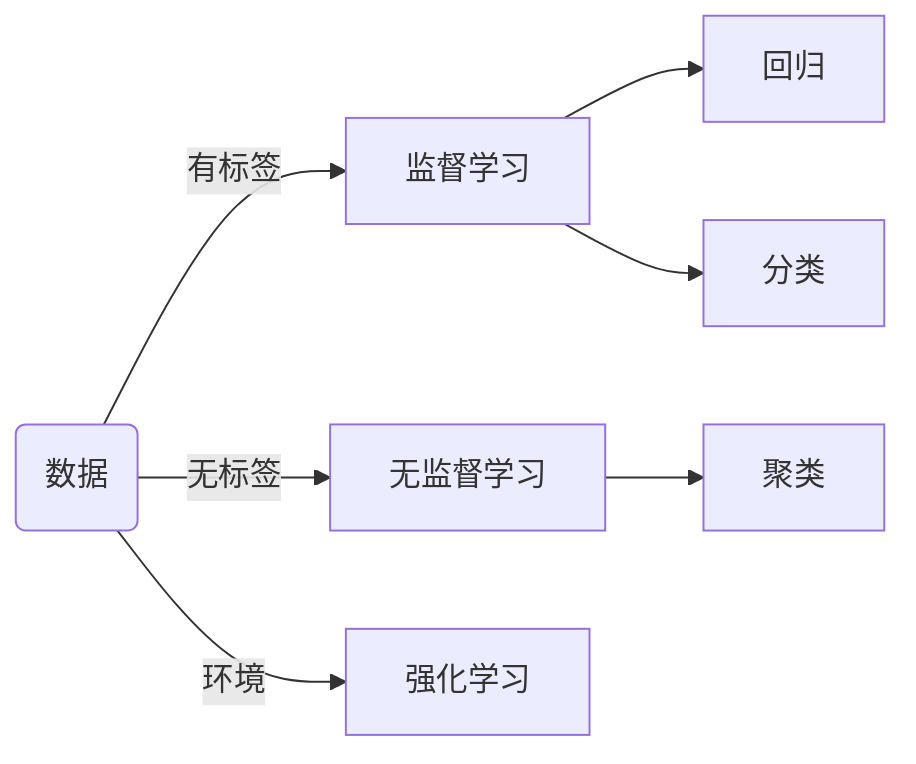
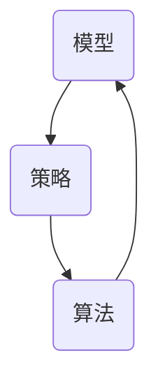
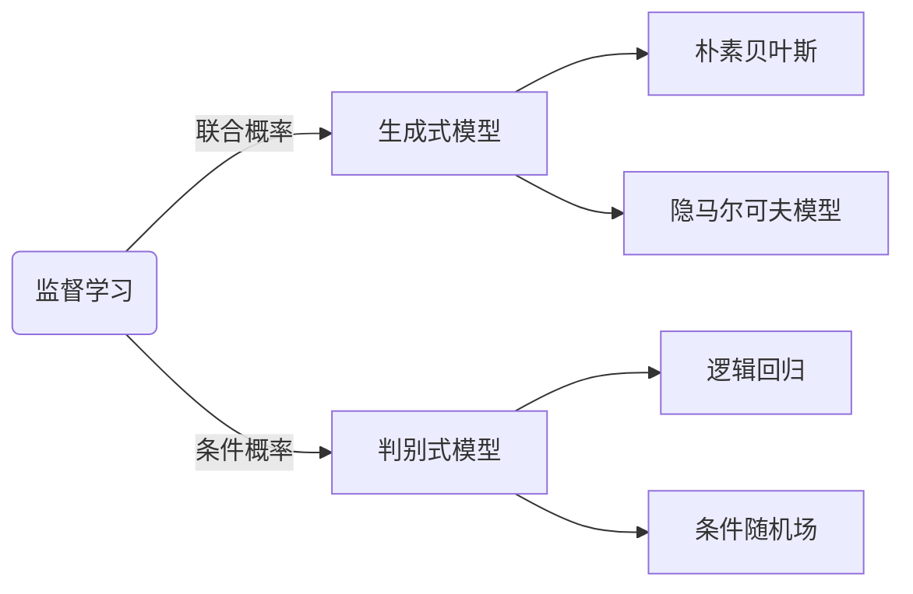
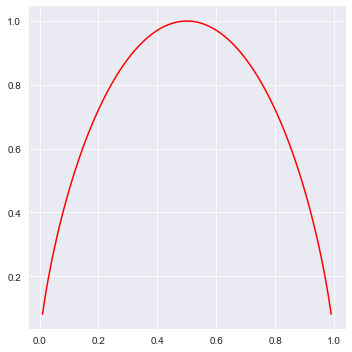

# 什么是机器学习
---

### 机器学习的定义
> computer program is said to learn from experience E with respect to some task T and some performance measure P，if its performance on T，as measured by P，improves with experience E. [Tom Mitchell,1998]

* E(Experience) 经验
* T(Task) 任务
* P(Performance) 性能

假设P来评估计算机程序在某任务类T上的性能，若一个程序通过利用经验E在T中任务上获得了性能改善，则关于T和P，该程序对E进行了学习。

### 机器学习的主要任务

给定在现实中获取的一系列**数据**来构建一个**模型**,用于描述数据的具体**分布**（概率意义上的分布）

##### 数据


##### 模型

我们可以认为机器学习模型是一个概率分布$$P_\theta(X)$$，其中$$X$$表示训练数据,机器学习的任务就是求解最优参数$$\theta_{t}$$的过程

> 极大似然估计（MLE）

$$
\theta_{t}=\underset{\theta}{\mathrm{argmax}}P_{\theta}(X)
$$

假设训练数据的单条数据之间相互独立

$$
\theta_{t}=\underset{\theta}{\mathrm{argmax}}\prod_{i}P_{\theta}(X_{i})=\underset{\theta}{\mathrm{argmax}}\sum_{i}\log P_{\theta}(X_{i})
$$
### 机器学习的方法论
- 三要素


- 一般步骤
    1. 得到一个有限的训练**数据**集合
    2. 确定包含所有可能的模型的**假设空间**，即学习模型的集合
    3. 确定模型选择的准则，即学习的策略（比如损失函数）
    4. 实现求解最优模型的算法，即学习的算法（比如梯度下降）
    5. 通过学习算法选择最优模型
    6. 利用学习的最优模型对新数据进行预测和分析

### 生成模型和判别模型

对于监督学习，训练集包含输入的数据$$X$$和对应的标签$$Y$$。所以我们应该求的概率分布有两种，即联合概率分布$$P_{\theta}(X,Y)$$和条件概率分布$$P_{\theta}(Y|X)$$,前者表示数据和标签**共现**概率，后者表示在给定数据的**条件**下对应的标签的概率。根据描述的概率分布，我们也可以把监督学习的机器学习模型分为**生成式模型**和**判别式模型**。



生成模型不仅可以根据输入$$X$$预测标签$$Y$$，还能根据训练得到的模型产生服从训练数据集分布的数据$$(X,Y)$$，相当于生成一组新的数据。
$$
P(Y|X)=\frac{P(X,Y)}{P(X)}
$$

判别模型仅能根据输入$$X$$预测标签$$Y$$。牺牲了生成数据的能力，获取的是比生成模型高的预测准确率。

###### 定性解释

根据**全概率公式**，相对条件概率，在计算联合概率的时候引入了输入数据的概率分布$$P(X)$$，而这不是我们关心的，于是削弱了模型的预测能力。
$$
P(X,Y)=\int P(Y|X)P(X)\text{d}X 
$$

###### 定量解释

根据**信息熵公式**，如果概率密度相对集中，则包含信息越少，信息熵就越小。
$$
H(X)=-\int P(X)\log P(X)\text{d}X
$$

<center></center>

```python
import seaborn as sns
import numpy as np
sns.set_style("darkgrid")
p = np.linspace(0,1,100)
h = -p*np.log2(p)-(1-p)*np.log2(1-p)

sns.relplot(x=p,y=h,kind='line',color="r")
```


定义联合分布的信息熵和条件分布的信息熵，由于$$H(X)\geq 0$$，可以得到条件分布的信息熵小于等于联合分布。对应到模型上可以认为判别模型比生成模型包含更多的信息。
$$
H(X,Y)=-\int P(X,Y)\log P(X,Y)\text{d}X\text{d}Y
$$
$$
H(Y|X)=-\int P(X,Y)\log P(Y|X)\text{d}X
$$
$$
H(Y|X)=H(X,Y)-H(X)
$$

### 如何优化机器学习模型

###### 回归模型
假设噪声$$f_{\theta}(X_i)-Y_i$$服从高斯分布$$\mathbb{N}(0,\sigma^{2})$$，这样就可以通过极大似然估计的方法计算最优参数$$\theta_t$$

$$
P(X) = \frac{1}{\sqrt{2\pi}\sigma}e^{-\frac{({X-\mu})^2}{2\sigma^2}}
$$
根据高斯公式，最大化条件概率分布$$P(Y|X)$$等价于最小化噪音的概率分布。
$$
\begin{align}
\theta_{t}&=\underset{\theta}{\mathrm{argmax}}\sum_i\log P_{\theta}(X_i) \\
          &=\underset{\theta}{\mathrm{argmax}}\sum_i\log\frac{1}{\sqrt{2\pi}\sigma }e^{-\frac{(f_\theta(X_i)-Y_i)^2}{2\sigma^2}} \\
          &=\underset{\theta}{\mathrm{argmin}}\sum_i{(f_\theta(X_i)-Y_i)^2}
\end{align}
$$
我们把$$argmin$$函数中需要优化的函数成为**损失函数**，该函数被称为**L2损失函数**或**MSE均方误差损失**。

假设误差服从拉普拉斯分布
$$
f(\varepsilon )=\frac{1}{2\lambda}e^{-\frac{\left |\varepsilon -\mu\right |}{\lambda}}
$$
$$
\theta_{t}=\underset{\theta}{\mathrm{argmin}}\sum_i\left | f_\theta(X_i)-Y_i\right |
$$
为了消除过拟合的状态，需要引入参数的先验分布，比如高斯分布，这样就能减小参数的选择范围。
$$
\begin{align}
\theta_{t}&=\underset{\theta}{\mathrm{argmax}}\sum_i\log P_\theta(X_i|\theta)P(\theta) \\
        &=\underset{\theta}{\mathrm{argmin}}\sum_i(f_\theta(X_i)-Y_i)^2+\frac{\alpha}{2}{\parallel \theta\parallel}^2 
\end{align}
$$
###### 分类模型