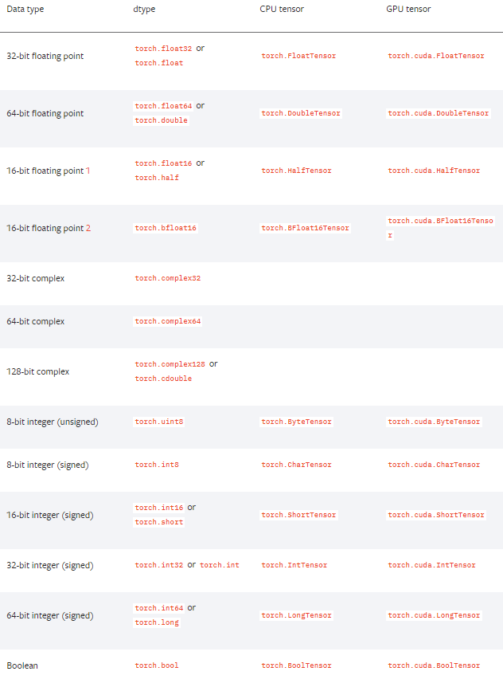

<center><h1>PyTorch Tutorial</h1></center>

## 指导思想

> 为了建立清晰的框架，按照建模步骤进行学习不失为一个好的思路
> 1. 得到一个有限的训练**数据**集合
> 2. 确定包含所有可能的模型的**假设空间**，即学习模型的集合
> 3. 确定模型选择的准则，即学习的策略（比如损失函数）
> 4. 实现求解最优模型的算法，即学习的算法（比如梯度下降）
> 5. 通过学习算法选择最优模型
> 6. 利用学习的最优模型对新数据进行预测和分析

#### 代码示例
```python
import torch
import torch.nn as nn
from sklearn.datasets import load_boston

boston = load_boston()

class LinearModel(nn.Module):
    def __init__(self , ndim ): # 定义类的初始化参数, a,b,c是传入的参数
        super(LinearModel,self).__init__()
        self.ndim = ndim
        self.weight = nn.Parameter(torch.randn(ndim,1))
        self.bias = nn.Parameter(torch.randn(1))
        
    def forward(self, x):
        # 定义前向计算的输入参数，一般是张量或其他的参数
        return x.mm(self.weight) + self.bias
        
lm = LinearModel(13) # 定义模型实例
criterion = nn.MSELoss() # 定义损失函数示例
optim = torch.optim.SGD(lm.parameters() , lr=1e-6) # 定义优化器实例
data = torch.tensor(boston["data"],requires_grad=True, dtype=torch.float32)
target = torch.tensor(boston["target"][:,np.newaxis],dtype=torch.float32)

for step in range(10000):
    predict = lm(data) # 模型预测结果
    loss = criterion(predict , target) # 输出损失
    if step and step % 1000 == 0 :
        print("Loss: {:.3f}".format(loss.item()))
    optim.zero_grad() # 清零梯度
    loss.backward() # 反向传播(梯度记录在对应张量里)
    optim.step() # 梯度下降
    
```  

## API基础

---

> 1. 得到一个有限的训练数据集合

#### 数据加载
###### DataSet
```python
import torch
import seaborn as sns
from torch.utils.data import Dataset

class TitanicDataset(Dataset):
    def __init__(self):
        data = sns.load_dataset("titanic")
        self.x_data = torch.from_numpy(data[['pclass','age','fare']].values)
        self.y_data = torch.from_numpy(data[['survived']].values)
        self.len = data.shape[0]
    
    def __getitem__(self, index):
        return self.x_data[index], self.y_data[index]

    def __len__(self):
        return self.len
```

###### DataLoader
参数|注释
--|--
dataset |  torch.utils.data.DataSet 类的实例 
batch_size=1  |  mini_batch的大小 
shuffle=False |  是否打乱数据,shuffle=True会构造默认的采样器进行采样 
sampler=None |  自定义采样器,构造 torch.utils.data.Sampler实例且设置shuffle=False 
batch_sampler=None |  同上,返回batch数量的索引 
num_workers=0 |  进程数目,默认单进程处理 
collate_fn=None |  定义如何把一批dataset转换为包含mini-batch数据的张量 
pin_memory=False |  转移数据到Pinned Memory(与GPU内存关联的CPU内存)，加快GPU载入数据速度 
drop_last=False |  如果最后一个batch小于设置数目,则丢弃 
timeout=0 |  若设置大于0,表示最多等待的时间 
worker_init_fn=None |  数据载入的子进程开始时运行的函数 

```python
from torch.utils.data import DataLoader
titanic = TitanicDataset()
trainloader = DataLoader(titanic, batch_size=4,shuffle=True)
```

#### 张量创建
- torch.tensor 函数
    * 列表 -> Tensor
    * Numpy数组 -> Tensor
- 内置函数
    * rand [0,1)均匀分布
    * randn 标准正态分布$$\mathbb{N}(0,1)$$
    * randint(0,10,(3,3)) 整数均匀分布 
    * zeros、ones、eye
- 形状拷贝
    * {内置函数}_like(t)mul
- 类型拷贝
    * t.new_tensor(列表/Numpy数组)
    * t.new_{内置函数}(size) ，没有随机元素填充函数
- 存储设备
    > 两个张量之间的运算只有在相同设备上才能进行
    
    - 创建张量时指定
        * torch.randn(3, 3, device="cpu") #默认
        * torch.randn(3, 3, device="cuda:0")
    - 获取张量所在设备
        * t.device
    - 转移设备
        * t.cpu()
        * t.cuda(1)
   
#### 张量类型
   

#### 数据并行化
  
---
> 5. 通过学习算法选择最优模型

#### 模型可视化 Tensorboard
在训练过程中，通过可视化能够直观地观测loss的趋势、张量的变化。

###### SummaryWriter
参数|说明
--|--
log_dir=None | 指定文件存储目录
comment=""| 文件夹名称添加注释信息
purge_step| 如果写入可视化数据崩溃,该步数之后的数据不再写入。数据写入是先进入队列,得到一定的数量触发文件的写入
max_queue|在写入磁盘之前内存中最多可保留的event(数据)的数量
flush_secs | 多长时间写入一次
filename_suffix=""| 文件名前缀

```bash
# 安装
pip install tensorflow==1.14.0 tensorflow-tensorboard==1.5.1 tensorboard==1.14.0
# 启动TensorBoard  默认 6006 端口
tensorboard -logdir runs
```

###### 可视化数据类型
* add_scalars( tag , data , step ) 
    * Scalars 曲线变化趋势
    * 一般格式服从Linux目录命名规则 name1/name2/...
* add_histogram( tag , data , step )
    * Distribution 最大最小值分布
    * Histogram 直方图分布
* add_image( tag , data)
    * Image 图片信息
    * 默认是 CHW 通道,高度,宽度
    * 一次传入多张图片 BCHW
* add_video( tag , data , fps )
    * 传入格式 NTCHW  T为视频时间的方向
* add_audio( tag , snd_tensor , sample_rate )
    * snd_tensor 是一个 1×L的张量,值在\[-1,1\]之间
    * sample_rate 采样频率
* add_text( tag , text_string )
* add_graph()  显示计算图
* add_pr_curve(labels , predictions , num_thresholds , weights)  显示准确率-召回率曲线

###### 调优经验
1. 损失上升或者震荡,说明学习率选择偏大,可以尝试降低学习率
1. 损失下降缓慢,说明学习率偏小,可以尝试适当增加学习率
1. 由于每个mini-batch未必会使得损失下降,可通过Somoothing滑块平滑损失曲线,平均多个mini-batch
1. 如果参数的分布一直没有变化,可能模型结构有问题或者梯度无法在模型中得到反向传播

---
> 6.利用学习的最优模型对新数据进行预测和分析

在模型选择和推断阶段，都需要建立checkpoint或者加载已有的模型数据,通过存储/加载模型结构和模型、优化器等参数达到想要的效果。

###### 模型保存(序列化器) torch.save
参数|注释
--|--
obj | 模型/张量/状态字典(推荐)
f | 文件路径
pickle_module=pickle | 序列化库
pickle_protocol=2 | pickle协议 0~4

###### 模型加载(反序列化器) torch.load
参数|注释
--|--
f | 文件路径
map_location=None | 设置迁移环境后的CPU或GPU及名称映射
pickle_module=pickle | 序列化库
**pickle_load_ars | 其它参数传送到 pickle_module.load函数

###### 状态字典
> 与pytorch版本关联性小,推荐以该形式保存

```python
save_info = {
    "iter_num":iter_num, # 迭代步数
    "optimizer": optimizer.state_dict(), # 优化器的状态字典
    "model" : model.state_dict(), # 模型的状态字典
}
# 保存信息
torch.save(save_info,save_path)
# 载入信息
save_info = torch.load(save_path)
optimizer.load_state_dict(save_info["optimizer"])
model.load_state_dict(save_info["model"])
```

## NLP模块
#### sklearn
- N-gram词频特征
    * CountVectorizer
- TF-IDF特征  
    * TfidfTransformer (基于CountVectorizer的结果)
    * TfidfVectorizer
    
$$
\text{TF_IDF}(t,d) = \text{TF}(t,d) \times \text{IDF}(t) \\
\text{IDF}(t) = \log \frac{1+N}{1+DF(t)}+1
$$
- word embedding层
- nn.Embedding 词向量矩阵  查找表

#### 实战篇

###### LSTM/Bi-LSTM分类

```python
import numpy as np
import torch
import torch.nn as nn
import torch.optim as optim

def make_batch():
    input_batch, target_batch = [], []

    for seq in seq_data:
        input = [word_dict[n] for n in seq[:-1]] # 'm', 'a' , 'k' is input
        target = word_dict[seq[-1]] # 'e' is target
        input_batch.append(np.eye(n_class)[input]) # 造embedding向量
        target_batch.append(target)

    return input_batch, target_batch

class TextLSTM(nn.Module):
    """
    LSTM + Linear分类器
    """
    def __init__(self):
        super(TextLSTM, self).__init__()

        self.lstm = nn.LSTM(input_size=n_class, hidden_size=n_hidden,batch_first=True)
        self.W = nn.Linear(n_hidden, n_class, bias=True)

    def forward(self, X):

        outputs, (_, _) = self.lstm(X)
        outputs = outputs[:,-1]  # B*N*H --> B*H
        model = self.W(outputs)   # model :B*H x H*O + O --> B*O
        return model

class BiLSTM(nn.Module):
    def __init__(self):
        super(BiLSTM, self).__init__()
        # 因为 word embedding 是 one-hot编码，所以 input-size是 n_class
        self.lstm = nn.LSTM(input_size=n_class, hidden_size=n_hidden, bidirectional=True,batch_first=True)
        self.W = nn.Linear(n_hidden * 2, n_class, bias=True)

    def forward(self, X):

        outputs, (_, _) = self.lstm(X)
        outputs = outputs[:,-1]  # B*(H+H)   Concat 双向向量
        model = self.W(outputs)  # model : [batch_size, n_class]
        return model

if __name__ == '__main__':
    n_hidden = 128 # number of hidden units in one cell

    char_arr = [c for c in 'abcdefghijklmnopqrstuvwxyz']
    word_dict = {n: i for i, n in enumerate(char_arr)}
    number_dict = {i: w for i, w in enumerate(char_arr)}
    n_class = len(word_dict)  # number of class(=number of vocab)

    seq_data = ['make', 'need', 'coal', 'word', 'love', 'hate', 'live', 'home', 'hash', 'star']

    model = TextLSTM()
    model2 = BiLSTM()

    criterion = nn.CrossEntropyLoss()
    optimizer = optim.Adam(model2.parameters(), lr=0.001)

    input_batch, target_batch = make_batch()
    input_batch = torch.FloatTensor(input_batch)
    target_batch = torch.LongTensor(target_batch)

    # Training
    for epoch in range(1000):
        optimizer.zero_grad()

        output = model2(input_batch)
        loss = criterion(output, target_batch)
        if (epoch + 1) % 100 == 0:
            print('Epoch:', '%04d' % (epoch + 1), 'cost =', '{:.6f}'.format(loss))

        loss.backward()
        optimizer.step()

    inputs = [sen[:3] for sen in seq_data]

    predict = model2(input_batch).data.max(1)[1]

    print(inputs, '->', [number_dict[n.item()] for n in predict])
```

## 源码分析

#### PyTorch模块组织结构

编号|模块|功能|说明
:--:|:--:|--|--
1|torch|激活函数、张量操作、张量创建|张量操作加下划线实现本地修改
2|torch.Tensor|张量类型|torch.Storage负责底层的数据存储
3|torch.sparse|稀疏张量| COO格式(Coordinate),长整型定义非零元素的位置，浮点数定义非零元素的值。稀疏张量之间可以做加减乘除运算和矩阵乘法。
4|torch.cuda|CUDA相关函数|对GPU操作
5|torch.nn|神经网络模块、损失函数|继承nn.Module类重写forward方法实现新模块；该模块的内容一般都含有参数
6|torch.nn.functional|神经网络函数（操作）模块|另外还有不常用的激活函数
7|torch.nn.init|权重初始化|均匀初始化、正态分布归一化等
8|torch.optim|优化器|包括学习率衰减算法
9|torch.autograd|自动微分函数|还内置了数值梯度功能和检查自动微分引擎是否正确输出的功能
10|torch.distributed|分布式计算模块|支持后端MPI、Gloo、NCCL，原理是启动多个进程并行，最后对所有进程权重张量的梯度做规约，然后广播到各模型
11|torch.distributions|采样模块|常用于强化学习策略。策略梯度算法，规避离散变量不能求导的问题
12|torch.hub|预训练模型|list、load
13|torch.jit|即时编译器|动态图转静态图
14|torch.multiprocessing|多进程API|进程间共享张量（共享内存），每个进程运行不同模型
15|torch.random|保存和设置随机数生成器状态|设置一个统一的随机种子可以帮助测试不同结构神经网络的表现，方便调试
16|torch.onnx|开放神经网络交换格式（ONNX）|方便不同框架交换模型
17|torch.utils|辅助工具模块|bottleneck检查模块运行时间方便优化<br>checkpoint记录计算过程节约内存<br>cpp_extension定义C++扩展<br>data数据集和载入器<br>dlpack定义格式转换<br>tensorboard可视化


### 张量操作
- 获取形状
    * t.size()
    * t.shape
- 获取维度数目
    * t.ndimension()
- 获取总元素数目    
    * t.nelement()
- 改变形状
    * t.view(3,4)
    * t.view(-1,4) 自动推断
    * t.view(2,6).contiguous() 不兼容，生成新的张量(兼容:新张量的两个连续维度的乘积等于原来张量的某一维度)
    * t.reshape(2,6)  相当于上面的语句
- 获得张量的数据指针
    * t.data_ptr 判断底层存储一致性
- 切片和索引
    * t\[:,3:5,:\] 共享内存
    * t\[:,3:5,:\].clone()
    * t\[t>0\] 返回一维向量 
- 张量运算
    * t.sqrt()
    * t.sqrt_()  In-Place操作
    * torch.sqrt(t)
    * keepdim=True 在进行求积、求和、求平均计算的同时，会自动消除被计算的维度，该参数用于保留维度 
- 张量的极值运算
    * t.argmax(t,1)  只返回位置
    * t.max(t,1) 返回元祖 ( value , idx)
    * t.sort(-1) 排序 ，返回元祖 (value , idx)
- 张量乘法
    * torch.mm 矩阵乘法(线性变换) 
    * @运算符 同上
    * t.mm(t1)  同上
    * t.bmm(t1) 批次矩阵乘法  b×m×k @ b×k×n => b×m×n
    * torch.einsum("bnk,bkl->bnl" , t , t1 ) 爱因斯坦求和约定
- 张量的堆叠与拼接
    * torch.stack(\[t,t1\]) 堆叠(增加维度) 3×4,3×4=>3×4×2
    * torch.cat(\[t,t1\]) 拼接(维度不变) 3×4,3×4=>3×8
- 张量的分割与分块
    * t.split(\[1,3\],-1) 分成 3×1和3×3两个张量
    * t.split(2,-1) 分成 最后一维大小为2的3×2大小的两个张量
    * t.chunk(2,-1) 分成 两个张量 (需要能整除)
- 张量维度的扩增与压缩
    * t.unsqueeze(-1) 扩维 3×4×1
    * t.squeeze() 压缩大小是1的维度
- 张量的广播
    * 两个不同维度的张量不能做四则运算
    * 两个张量对应维度需要至少有一个维度大小为1或者两个维度大小相等
   
### 模块类

- 获取模型参数
    * named_parameters
    * parameters 返回生成器 
    * 模型参数初始化由初始化模型的类实例开始
    * nn.Parameters继承nn.Tensor ,默认 requires_grid=True
    * 几乎所有张量创建方式都有requires_grid参数,一旦设置为True,后序中间结果的张量都会被设置成True
- 模型训练和测试状态转换
    * train
    * eval
- 获取张量的缓存
    * named_buffers
    * buffers 返回生成器
    * 缓存同样是参数,但是不参与梯度传播，在训练中会得到更新,比如Batch-Norm 均值、方差参数
    * register_buffer 注册张量为缓存
- 获取模型的子模块
    * named_children
    * children 返回生成器
    * named_modules
    * modules 获取模块中所有模块的信息
- apply函数应用
    * 递归地对子模块应用自定义函数
- 模型参数类型、存储设备
    * lm.cuda() # 参数转移到GPU
    * lm.half() # 参数转换为半精度浮点数 float16

### 计算图与自动求导
- 梯度与反向传播
    - t.grad_fn 导数函数
    - t.grad 存储梯度信息
    - t.grad.zero_()  梯度清零，默认多次反向传播梯度是累积的
    - torch.autograd.backward()  传入根节点张量和初始梯度张量（默认1）
    - torch.autograd.grad(数据结果张量,需要对计算图求导的张量) 求梯度方法
- 计算图
    - retain_graph=True 反向传播时保留前向计算图
    - create_graph=True 创建梯度计算图
    - with torch.no_grad() 上下文管理器，不建立计算图，张量没有grid_fn
    - t.detach() 与原计算图分离
    
### 损失函数与优化器
- 损失函数
    * 模块形式 torch.nn
    * 函数形式 torch.nn.functional
    * loss.backward() 反向传播，记录梯度在对应张量里
    * torch.nn.BCELoss 二分类交叉熵损失
    * torch.nn.BECWithLogitsLoss 二分类几率交叉熵损失(直接输入几率,不需要Sigmoid)
    * torch.nn.NLLLoss 负对数似然损失（先计算Softmax取对数的结果）
    * torch.nn.functional.log_softmax 
    * torch.nn.CrossEntropyLoss 交叉熵损失(无需提前计算softmax取对数)
    
- 优化器
    * optim.zero_grad()  梯度清零
    * optim.step() 梯度下降
    * torch.optim.Adagrad( lr_decay , weight_decay , initial_accumulator_value)
    * torch.optim.RMSprop( alpha , eps, weight_decay , momentum , centered)
    * torch.optim.Adam( betas , eps, weight_decay , amsgrad)
    * torch.optim.lr_scheduler.StepLR(optimizer , step_size=30 , gamma=0.1) 学习率衰减
    * torch.optim.lr_scheduler.CosineAnnealingLR 学习率衰减--余弦退火算法
    
