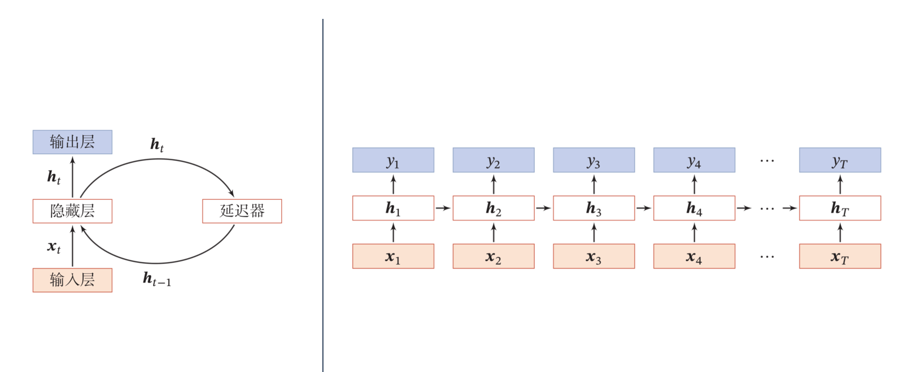
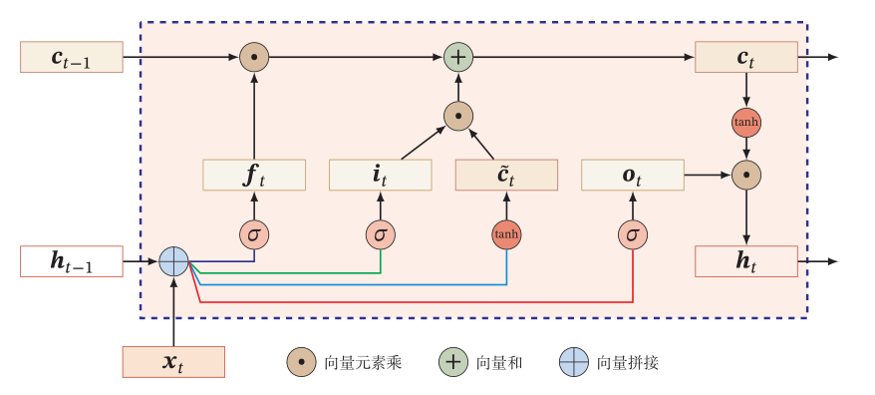
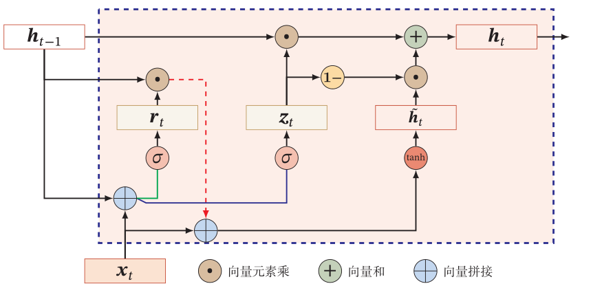
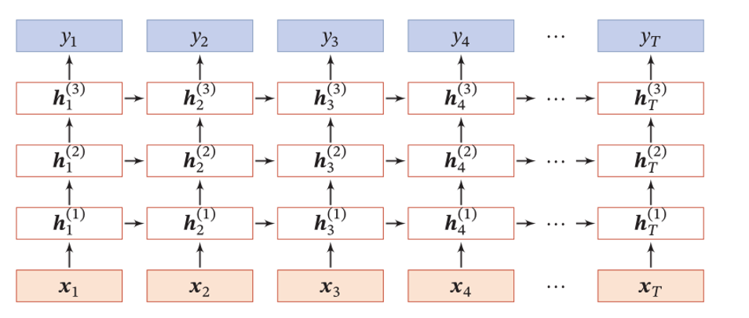
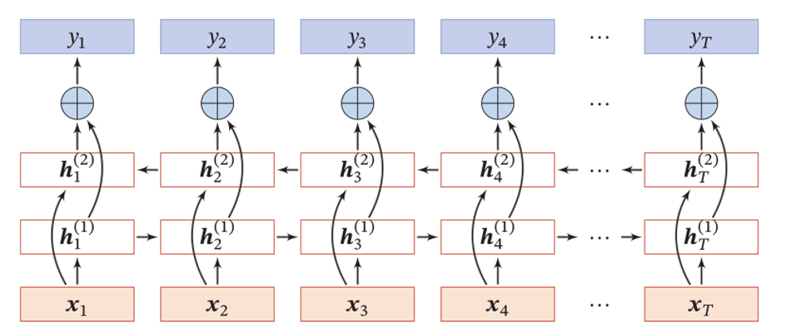
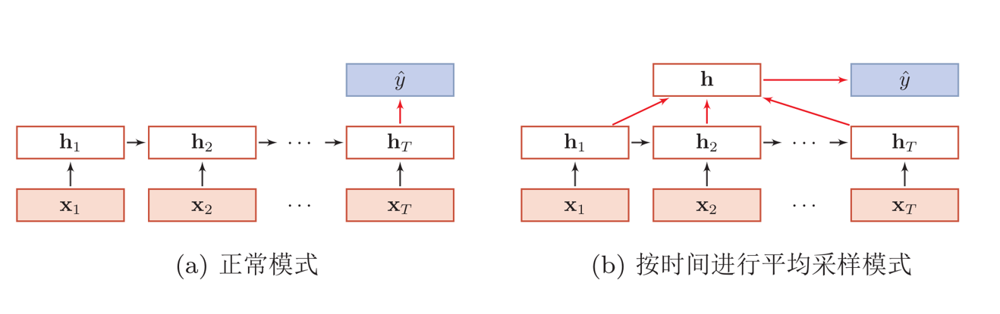
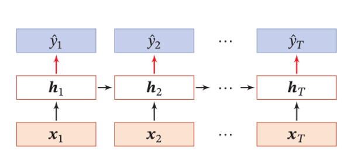
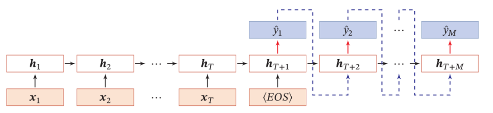

# RNN 循环神经网络
> 为了处理时序数据并利用其历史信息，我们需要让网络具有**短期记忆**能力，而前馈网络是一种静态网络，不具备这种记忆能力。

#### 经典模型

###### Simple RNN

$$
h_t=f(Uh_{t-1}+Wx_t+b)
$$

###### LSTM

学习的参数可以看作**长时记忆**，$$h_t$$看作短时记忆（外部记忆状态），$$c_t$$看作比较长的短时记忆（内部记忆状态），即Long Short-Term Memory。

LSTM执行的步骤如下：
1. 利用上一时刻的外部状态$$h_{t-1}$$和当前时刻的输入$$x_t$$计算出三个门（输入门、输出门、遗忘门）以及候选状态$$\widetilde{c}_t$$。
2. 结合遗忘门$$f_t$$和输入门$$i_t$$更新记忆单元$$c_t$$。
3. 结合输出门$$o_t$$，将内部状态的信息传递给外部状态$$h_t$$。
 
$$
\begin{align}

\begin{bmatrix}
\widetilde{c}_t\\ 
o_t\\ 
i_t\\ 
f_t
\end{bmatrix}&= 
\begin{bmatrix}
\tanh\\ 
\sigma\\ 
\sigma\\ 
\sigma
\end{bmatrix}\left ( 
\mathbf{W}\begin{bmatrix}
x_t\\ 
h_{t-1}
\end{bmatrix} + b \right ) \\
c_t&=f_t\odot c_{t-1}+i_t\odot\widetilde{c}_t\\
h_t&=o_t\odot\tanh\left ( c_t \right )
\end{align}
$$

> 训练经验 : 遗忘门的参数初始值一般都设置得比较大，其偏置向量$$b_f$$设为1或2。过小的值意味着刚训练时遗忘门的概率值过小，大部分信息都会丢失，而且梯度也会非常小，从而导致梯度消失问题。

 LSTM变体
 * 无遗忘门的$$LSTM_{1997}$$
 $$
 c_t=c_{t-1}+i_t\odot\widetilde{c}_t
 $$
 * peephole
 
 输入不止依赖上一时刻的隐状态$$h_{t-1}$$，也依赖上一时刻的记忆单元$$c_{t-1}$$
 $$
 \begin{align}
 i_t&=\sigma\left ( W_ix_t+U_ih_{t-1}+V_ic_{t-1}+b_i\right ) \\
 f_t&=\sigma\left ( W_fx_t+U_fh_{t-1}+V_fc_{t-1}+b_f\right ) \\
 o_t&=\sigma\left ( W_ox_t+U_oh_{t-1}+V_oc_t+b_o\right ) 
 \end{align}
 $$
 
* 耦合输入门和遗忘门
$$
\begin{align}
c_t&=(1-i_t)\odot c_{t-1} +i_t\odot\widetilde{c}_t
\end{align}
$$

###### GRU

不引入额外的记忆单元，而是引入更新门控制当前状态需要从历史状态中保留多少信息以及需要从候选状态中接受多少新信息。
GRU执行的步骤如下:
1. 利用上一时刻的外部状态$$h_{t-1}$$和当前时刻的输入$$x_t$$计算出两个门（更新门、重置门）。
2. 计算候选状态$$\widetilde{h}_t$$，重置门用来控制候选状态$$\widetilde{h}_t$$的计算依赖多少上一时刻的状态$$h_{t-1}$$。
3. 使用更新门进行状态更新。 
$$
\begin{align}
z_t&=\sigma\left ( W_zx_t+U_zh_{t-1}+b_z\right) \\
r_t&=\sigma\left ( W_rx_t+U_rh_{t-1}+b_r\right) \\
\widetilde{h}_t&=\tanh\left ( W_hx_t+U_h(r_t\odot h_{t-1})+b_h \right ) \\
h_t&=z_t\odot h_{t-1} + (1-z_t)\odot \widetilde{h}_t
\end{align}
$$

#### 深层模型

###### 堆叠循环神经网络

###### 双向循环神经网络

#### 应用框架

###### 序列到类

###### 同步的序列到序列

###### 异步的序列到序列
