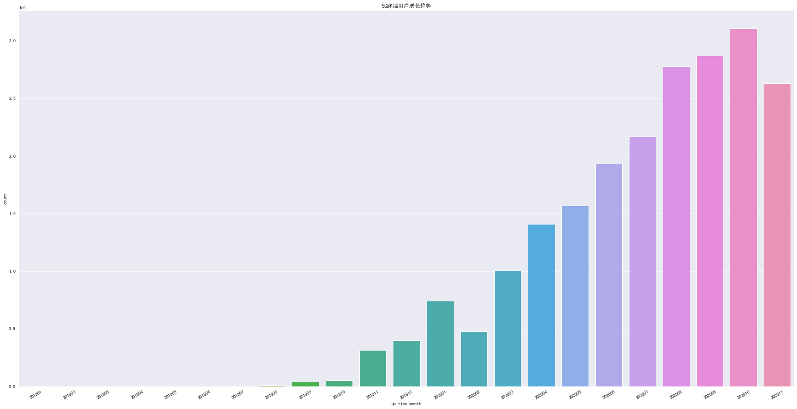
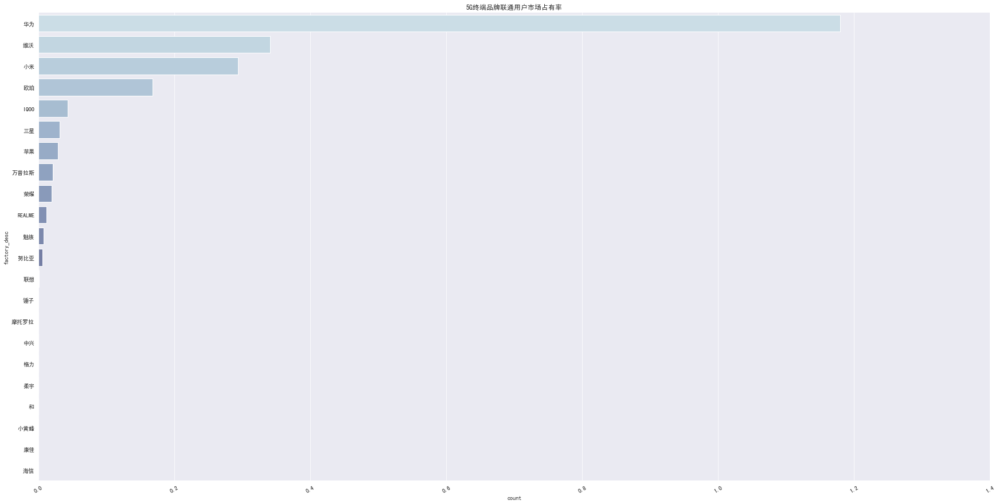
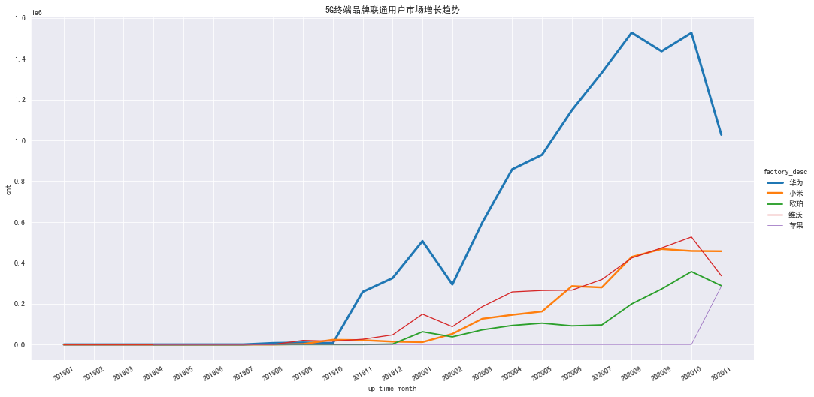
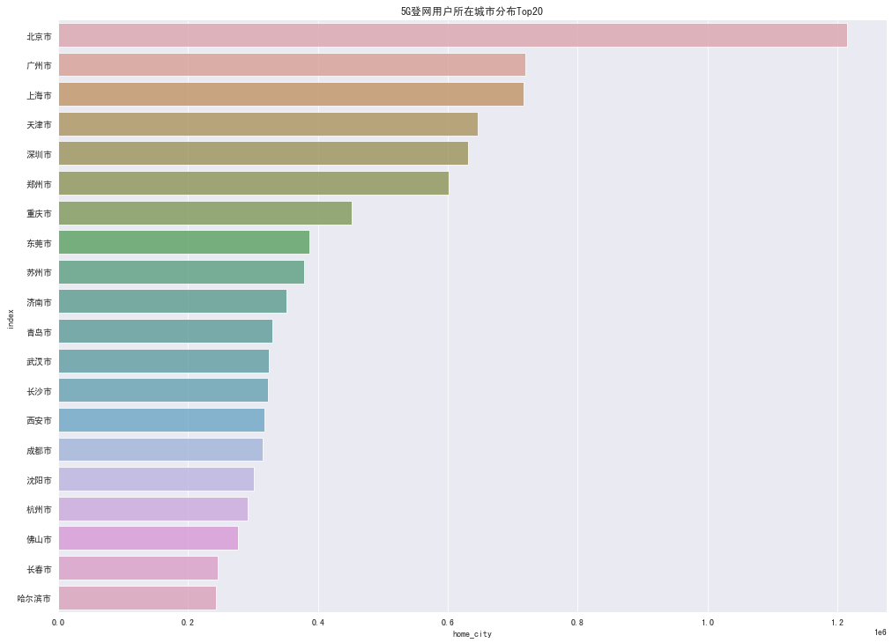
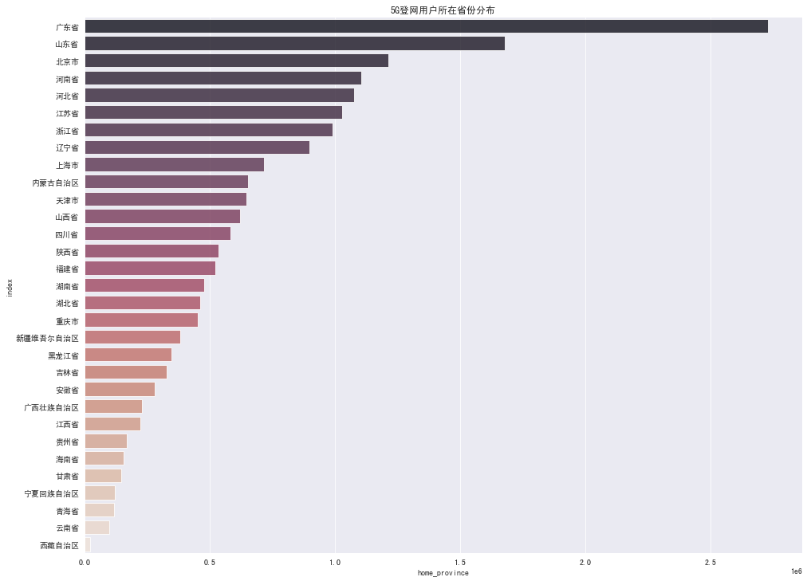
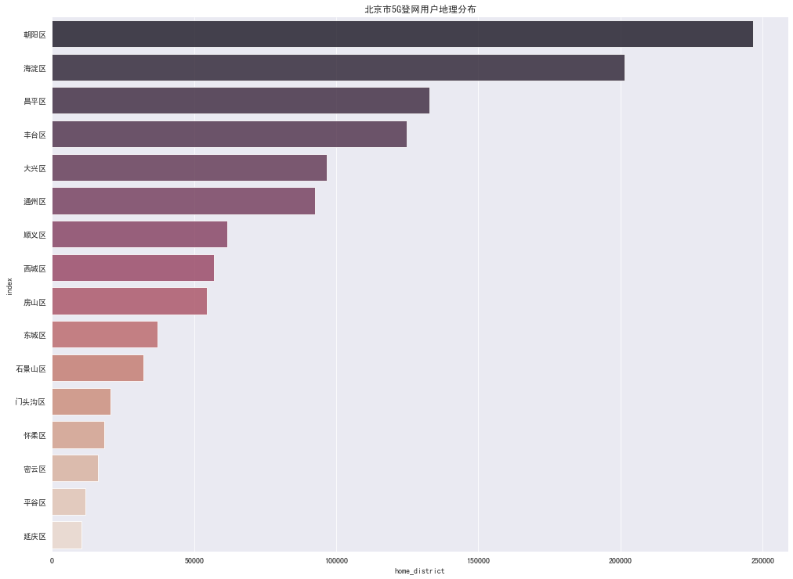
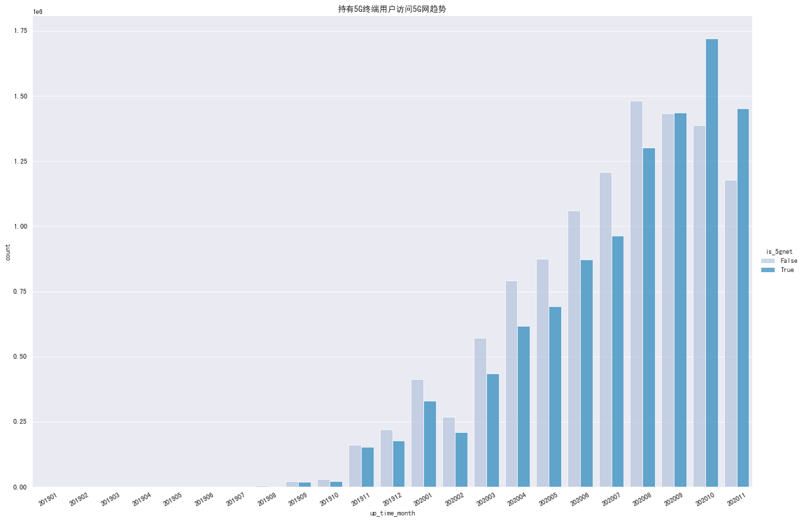

# 5G共建共享工作组数据分析
---
### 5G终端用户
* 5G终端表【采集】`dim_5gterm`与换机记录表`ubd_dm.dwa_d_res_al_imei_change_15days`和用户信息表`ubd_ana_test3.userinfo`连接,获得**5G终端用户**列表
```sql
-- presto
select device_number, use_days, up_time, T_change.factory_desc, T_change.term_desc, create_time
from postgresql.public.dim_5gterm T_5gterm
         join (select device_number, use_days, up_time, factory_desc, term_desc
               from hive319.ubd_b_dwa.dwa_d_res_al_imei_change_15days
               where month_id = '202012'
                 and day_id = '06'
                 and use_order = '1') T_change
              on T_5gterm.factory_desc = T_change.factory_desc and T_5gterm.term_desc = T_change.term_desc  
```

* 根据用户更换5G手机的每月总体增长趋势



* 5G终端品牌联通用户市场占有率总体分布



* 重点5G终端品牌联通用户市场占有率增长趋势(月份)


   > 苹果5G手机发布较晚，换机用户量开始有抬头迹象
   
---
### 5G网用户

* 提取`ubd_dm.dwa_v_m_cus_nm_user_info`的`service_type`字段为`50AAAAAA`的用户,匹配用户信息表`userinfo`的基础信息和职驻信息

```sql
-- hive
select *
from (select device_number
      from ubd_dm.dwa_v_m_cus_nm_user_info
      where month_id = '202011'
        and service_type = '50AAAAAA'
        and is_innet = '1'
        and remove_tag = '0') T_user_info
         left join (select msisdn,
                           sex,
                           age,
                           home_province,
                           home_city,
                           home_district,
                           work_province,
                           work_city,
                           word_district,
                           home_lon,
                           home_lat,
                           work_lon,
                           work_lat
                    from ubd_ana_test_3.userinfo
                    where month_id = '202011') T_userinfo
                   on T_user_info.device_number = T_userinfo.msisdn
```

* 5G登网用户居住地（城市）分布Top20



* 5G登网用户居住地（省份）分布



* 北京市5G登网用户居住地（区县）分布



---
### 5G终端用户与5G网用户

* 持有5G终端用户访问5G网增长趋势



* 5G基站（望京地区）分布热力图
<iframe  
 height=450 
 width=80% 
 src="img/G5_station.html"  
 frameborder=0>
 </iframe>
 
* 5G登网用户居住地（望京地区）分布热力图
<iframe  
 height=450 
 width=80% 
 src="img/G5_user.html"  
 frameborder=0>
 </iframe>